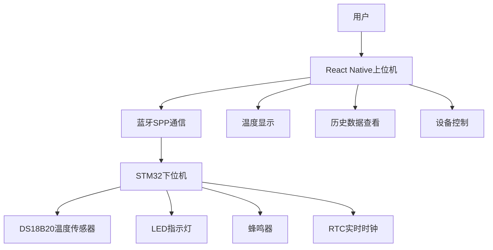
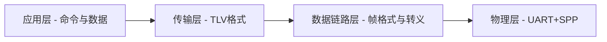
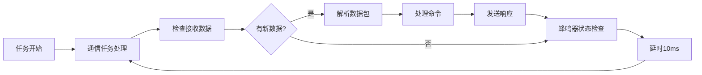
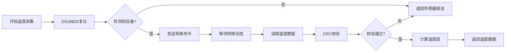
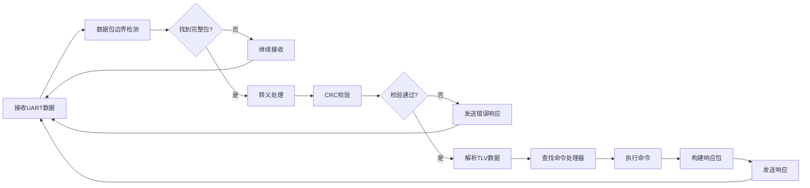
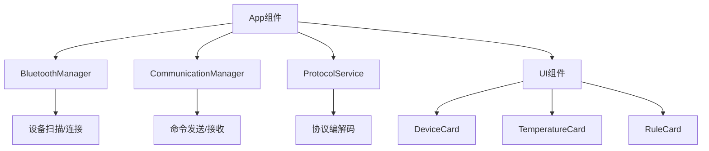
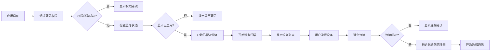
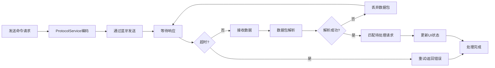
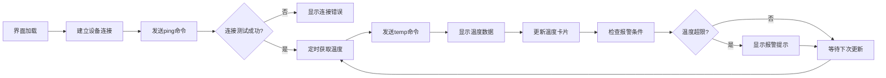

# 基于STM32和React Native的智能温度监测系统实验报告

## 1. 系统概述

本项目设计并实现了一个基于STM32F103ZET6微控制器和React Native移动应用的智能温度监测系统。系统采用分布式架构，包括下位机（STM32）和上位机（React Native App），通过蓝牙SPP协议进行通信，实现远程温度监测、数据记录、报警控制等功能。

## 2. 系统架构

### 2.1 整体架构



### 2.2 硬件架构

**下位机硬件组成：**
- **主控制器**：STM32F103ZET6 (ARM Cortex-M3内核)
- **温度传感器**：DS18B20数字温度传感器
- **指示设备**：LED灯（PWM控制）、蜂鸣器（PWM控制）
- **通信模块**：蓝牙模块（UART接口）
- **时钟**：RTC实时时钟

**上位机硬件：**
- Android/iOS智能手机
- 内置蓝牙模块

### 2.3 软件架构

**下位机软件架构：**
- **操作系统**：FreeRTOS实时操作系统
- **HAL层**：STM32 HAL库
- **应用层**：温度采集、通信协议处理、设备控制

**上位机软件架构：**
- **框架**：React Native跨平台开发框架
- **蓝牙通信**：react-native-bluetooth-classic
- **UI组件**：自定义Neumorphic风格组件

## 3. 通信协议设计

### 3.1 协议栈结构



### 3.2 数据链路层协议

**帧格式：**
```
| 起始符(2B) | 数据包内容(nB) | 结束符(2B) |
| 0xAA 0x55  |      ...       | 0x55 0xAA  |
```

**转义机制：**
- 数据中的0xAA和0x55需要转义
- 0xAA → 0xAA00, 0x55 → 0x5500

### 3.3 传输层协议

**数据包格式：**
```
| 版本(1B) | 类别(1B) | 包编号(2B) | 响应编号(2B) | 数据长度(2B) | 数据内容(nB) | CRC32(4B) |
```

**字段说明：**
- **版本**：0x02
- **类别**：0x00(主机请求)、0x11(从机响应)、0x1F(从机错误)
- **包编号**：主机0x00-0x7F，从机0x8000-0x80FF
- **CRC32**：STM32硬件CRC校验

### 3.4 应用层协议

**TLV数据格式：**
```
| Tag(2B) | Length(2B) | Value(nB) |
```

**主要命令集：**
- `ping` - 连接测试
- `temp` - 获取温度
- `gdat`/`sdat` - 日期管理
- `gtim`/`stim` - 时间管理
- `galm`/`salm` - 报警配置
- `glog` - 历史日志
- `sled`/`rled` - LED控制
- `sbzr`/`rbzr` - 蜂鸣器控制

## 4. 下位机软件设计

### 4.1 系统初始化流程


### 4.2 主任务流程



### 4.3 温度采集流程



### 4.4 通信协议处理



## 5. 上位机软件设计

### 5.1 应用架构



### 5.2 蓝牙连接流程



### 5.3 数据通信流程



### 5.4 温度监测界面流程



## 6. 关键技术实现

### 6.1 DS18B20温度传感器

**技术特点：**
- 单总线数字温度传感器
- 测量精度：±0.5°C（-10°C至+85°C）
- 分辨率：9-12位可配置
- 供电：3.0V-5.5V

**实现要点：**
- 使用GPIO开漏模式模拟单总线协议
- 精确的时序控制（微秒级延时）
- 在RTOS环境下使用临界段保护时序
- CRC校验确保数据完整性

### 6.2 FreeRTOS任务管理

**任务设计：**
- `defaultTask`：主任务，处理通信和设备控制
- 任务优先级：Normal
- 栈大小：512字节
- 任务调度：抢占式调度

**同步机制：**
- 使用临界段保护DS18B20时序
- DMA中断回调处理UART数据
- 任务间通过全局变量共享状态

### 6.3 React Native蓝牙通信

**关键库：**
- `react-native-bluetooth-classic`：经典蓝牙SPP通信
- 支持Android/iOS双平台

**实现特点：**
- 异步连接管理
- 数据流式处理
- 错误重试机制
- 连接状态监控

### 6.4 协议栈实现

**下位机协议栈：**
- 模块化设计：`communication.c`、`protocol.c`、`command_handler.c`
- 状态机处理数据包解析
- TLV编解码工具函数
- 错误处理和恢复机制

**上位机协议栈：**
- TypeScript类型安全
- Promise-based异步API
- 数据包缓冲和重组
- 超时和重试逻辑

## 7. 心得体会

### 7.1 技术收获

**嵌入式开发：**
通过本项目深入理解了STM32微控制器的开发流程，掌握了HAL库的使用、FreeRTOS实时操作系统的任务管理，以及GPIO、UART、DMA、RTC等外设的配置和使用。特别是在DS18B20单总线协议的实现过程中，体会到了精确时序控制的重要性，学会了在RTOS环境下处理硬件时序的方法。

**通信协议设计：**
设计和实现了完整的分层通信协议，从物理层的UART+SPP，到数据链路层的帧格式和转义机制，再到传输层的包结构和校验，最后到应用层的TLV格式，深刻理解了网络协议栈的设计思想。特别是错误处理和恢复机制的设计，让系统具备了良好的容错能力。

**移动端开发：**
掌握了React Native跨平台开发技术，学会了使用TypeScript进行类型安全的开发，理解了React Hooks的使用模式，以及异步编程和状态管理的最佳实践。在蓝牙通信的实现过程中，深入了解了Android/iOS平台的蓝牙API差异和权限管理。

### 7.2 工程实践

**模块化设计：**
项目采用了模块化的设计思想，下位机的代码按功能划分为通信、协议、命令处理、设备控制等模块，上位机也按照服务层、管理层、UI层进行分层。这种设计提高了代码的可维护性和可扩展性。

**错误处理：**
在系统设计中充分考虑了各种异常情况，包括硬件故障、通信中断、数据损坏等，建立了完善的错误检测、报告和恢复机制。这对构建稳定可靠的产品至关重要。

**调试方法：**
学会了多种调试技术，包括STM32的SWD调试、串口日志输出、逻辑分析仪时序分析，以及React Native的Chrome开发者工具调试。特别是在协议调试过程中，通过十六进制数据包分析发现和解决了多个通信问题。

### 7.3 项目管理

**版本控制：**
使用Git进行版本控制，建立了规范的分支管理和提交信息格式，通过版本标签管理项目的里程碑版本。

**文档管理：**
重视技术文档的撰写，包括需求文档、设计文档、接口文档、测试文档等，形成了完整的项目文档体系。

### 7.4 未来改进

**功能扩展：**
- 增加多传感器支持（湿度、气压等）
- 实现数据云端同步
- 添加图表分析功能
- 支持多设备管理

**性能优化：**
- 优化通信协议减少延迟
- 实现低功耗模式
- 增加数据压缩算法
- 提升UI响应速度

**可靠性提升：**
- 增加看门狗保护
- 实现固件在线升级
- 添加数据备份机制
- 完善异常处理逻辑

### 7.5 总结

本项目是一次完整的嵌入式系统开发实践，涵盖了硬件设计、嵌入式软件开发、移动应用开发、通信协议设计等多个技术领域。通过项目的实施，不仅掌握了相关的技术技能，更重要的是培养了系统性思维和工程实践能力。

项目的成功实现证明了技术方案的可行性，同时也暴露了一些不足之处，为后续的改进提供了方向。这种从需求分析、系统设计、编码实现到测试验证的完整开发流程，为将来参与更大规模的工程项目积累了宝贵经验。

通过这个项目，深刻体会到了软硬件协同开发的复杂性和挑战性，也认识到了文档、测试、调试等工程实践的重要性。未来将继续在嵌入式和移动开发领域深入学习，努力成为一名优秀的全栈工程师。

---

**项目时间：** 2025年6月  
**开发人员：** [倪旌哲： 负责上位机开发， 马晨曦： 负责下位机开发和通信协议， 刘阳： 负责温度传感驱动]  
**项目代码：** https://github.com/NiJingzhe/ConnectedCewenBox